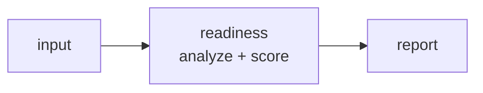

<a name="top"></a>
<div align="center">


# READINESS

### Compute unit readiness (C-ratings style) from a personnel/equipment/training YAML and flag gaps.


[](https://pypi.org/project/cognis-readiness/) [](https://github.com/cognis-digital/readiness/actions) [](LICENSE) [](https://github.com/cognis-digital)

*Part of the Cognis Neural Suite.*

</div>

```bash
pip install cognis-readiness
readiness scan .            # → prioritized findings in seconds
```


<!-- cognis:example:start -->
## 🔎 Example output

Real, reproducible output from the tool — runs offline:

```console
$ readiness-emit --version
readiness 0.1.0
```

```console
$ readiness-emit --help
usage: readiness [-h] [--version] {assess} ...

SORTS-style unit readiness as code (defensive/analytical).

positional arguments:
  {assess}
    assess    compute C-ratings and flag gaps

options:
  -h, --help  show this help message and exit
  --version   show program's version number and exit
```

> Blocks above are real `readiness` output — reproduce them from a clone.

**Sample result format** _(illustrative values — run on your own data for real findings):_

```
{
"readiness": {
"platform": "stix",
"findings": [
{
"id": "1234567890",
"name": "Example Finding 1",
"description": "This is an example finding.",
"created_by": "John Doe"
},
{
"id": "2345678901",
"name": "Example Finding 2",
"description": "This is another example finding.",
"created_by": "Jane Smith"
}
]
}
}
```

<!-- cognis:example:end -->

## Usage — step by step

1. **Install** (Python 3.9+):

   ```bash
   pip install readiness            # or: pipx install readiness
   ```

2. **Assess a readiness file.** Point the `assess` subcommand at a readiness YAML input to compute C-ratings and flag gaps:

   ```bash
   readiness assess units.yaml
   ```

3. **Get machine-readable output** for dashboards or further processing with `--format json`:

   ```bash
   readiness assess units.yaml --format json > readiness.json
   ```

4. **Read the result.** The report lists each entity's C-rating (1–5, lower is better) and the gaps driving it. In JSON mode, parse the structured findings; the process also returns a non-zero exit code when the overall level is worse than the `--fail-under` threshold (default `3`).

5. **Gate in CI.** Fail the pipeline automatically when readiness slips below your bar:

   ```bash
   readiness assess units.yaml --fail-under 2   # exit non-zero if overall worse than level 2
   ```

## Contents

- [Why readiness?](#why) · [Features](#features) · [Quick start](#quick-start) · [Example](#example) · [Architecture](#architecture) · [AI stack](#ai-stack) · [How it compares](#how-it-compares) · [Integrations](#integrations) · [Install anywhere](#install-anywhere) · [Related](#related) · [Contributing](#contributing)

<a name="why"></a>
## Why readiness?

Compute unit readiness (C-ratings style) from a personnel/equipment/training YAML and flag gaps. — without standing up heavyweight infrastructure.

`readiness` is single-purpose, scriptable, and self-hostable: point it at a target, get prioritized results in the format your workflow already speaks (table · JSON · SARIF), gate CI on it, and let agents drive it over MCP.

<div align="right"><a href="#top">↑ back to top</a></div>

<a name="features"></a>
## Features

- ✅ C Level From Pct
- ✅ Overall C Level
- ✅ Parse Yaml
- ✅ Assess
- ✅ Assess Text
- ✅ To Json
- ✅ Runs on Linux/macOS/Windows · Docker · devcontainer
- ✅ Ports in Python, JavaScript, Go, and Rust (`ports/`)

<div align="right"><a href="#top">↑ back to top</a></div>

<a name="quick-start"></a>
## Quick start

```bash
pip install cognis-readiness
readiness --version
readiness scan .                       # scan current project
readiness scan . --format json         # machine-readable
readiness scan . --fail-on high        # CI gate (non-zero exit)
```

<div align="right"><a href="#top">↑ back to top</a></div>

<a name="example"></a>
## Example

```text
$ readiness scan .
  [HIGH    ] REA-001  example finding             (./src/app.py)
  [MEDIUM  ] REA-002  another signal              (./config.yaml)

  2 findings · risk score 5 · 38ms
```

<div align="right"><a href="#top">↑ back to top</a></div>

<a name="architecture"></a>
## Architecture



<div align="right"><a href="#top">↑ back to top</a></div>

<a name="ai-stack"></a>
## Use it from any AI stack

`readiness` is interoperable with every popular way of using AI:

- **MCP server** — `readiness mcp` (Claude Desktop, Cursor, Cognis.Studio, [uncensored-fleet](https://github.com/cognis-digital/uncensored-fleet))
- **OpenAI-compatible / JSON** — pipe `readiness scan . --format json` into any agent or LLM
- **LangChain · CrewAI · AutoGen · LlamaIndex** — wrap the CLI/JSON as a tool in one line
- **CI / scripts** — exit codes + SARIF for non-AI pipelines

<div align="right"><a href="#top">↑ back to top</a></div>

<a name="how-it-compares"></a>
## How it compares

| | **Cognis readiness** | typical tools |
|---|:---:|:---:|
| Self-hostable, no account | ✅ | varies |
| Single command, zero config | ✅ | ⚠️ |
| JSON + SARIF for CI | ✅ | varies |
| MCP-native (AI agents) | ✅ | ❌ |
| Polyglot ports (JS/Go/Rust) | ✅ | ❌ |
| Open license | ✅ COCL | varies |
<div align="right"><a href="#top">↑ back to top</a></div>

<a name="integrations"></a>
## Integrations

Pipes into your stack: **SARIF** for code-scanning, **JSON** for anything, an **MCP server** (`readiness mcp`) for AI agents, and a webhook forwarder for SIEM/Slack/Jira. See [`docs/INTEGRATIONS.md`](docs/INTEGRATIONS.md).

<div align="right"><a href="#top">↑ back to top</a></div>

<a name="install-anywhere"></a>
## Install — every way, every platform

```bash
pip install "git+https://github.com/cognis-digital/readiness.git"    # pip (works today)
pipx install "git+https://github.com/cognis-digital/readiness.git"   # isolated CLI
uv tool install "git+https://github.com/cognis-digital/readiness.git" # uv
pip install cognis-readiness                                          # PyPI (when published)
docker run --rm ghcr.io/cognis-digital/readiness:latest --help        # Docker
brew install cognis-digital/tap/readiness                             # Homebrew tap
curl -fsSL https://raw.githubusercontent.com/cognis-digital/readiness/main/install.sh | sh
```

| Linux | macOS | Windows | Docker | Cloud |
|---|---|---|---|---|
| `scripts/setup-linux.sh` | `scripts/setup-macos.sh` | `scripts/setup-windows.ps1` | `docker run ghcr.io/cognis-digital/readiness` | [DEPLOY.md](docs/DEPLOY.md) (AWS/Azure/GCP/k8s) |

<div align="right"><a href="#top">↑ back to top</a></div>

<a name="related"></a>
## Related Cognis tools


**Explore the suite →** [🗂️ all 170+ tools](https://github.com/cognis-digital/cognis-neural-suite) · [⭐ awesome-cognis](https://github.com/cognis-digital/awesome-cognis) · [🔗 cognis-sources](https://github.com/cognis-digital/cognis-sources) · [🤖 uncensored-fleet](https://github.com/cognis-digital/uncensored-fleet) · [🧠 engram](https://github.com/cognis-digital/engram)

<div align="right"><a href="#top">↑ back to top</a></div>

<a name="contributing"></a>
## Contributing

PRs, new rules, and demo scenarios are welcome under the collaboration-pull model — see [CONTRIBUTING.md](CONTRIBUTING.md) and [SECURITY.md](SECURITY.md).

> ### ⭐ If `readiness` saved you time, **star it** — it genuinely helps others find it.

## Interoperability

`{}` composes with the 300+ tool Cognis suite — JSON in/out and a shared
OpenAI-compatible `/v1` backbone. See **[INTEROP.md](INTEROP.md)** for the
suite map, composition patterns, and reference stacks.

## License

Source-available under the **Cognis Open Collaboration License (COCL) v1.0** — free for personal, internal-evaluation, research, and educational use; **commercial / production use requires a license** (licensing@cognis.digital). See [LICENSE](LICENSE).

---

<div align="center"><sub><b><a href="https://cognis.digital">Cognis Digital</a></b> · one of 170+ tools in the <a href="https://github.com/cognis-digital/cognis-neural-suite">Cognis Neural Suite</a> · <i>Making Tomorrow Better Today</i></sub></div>
